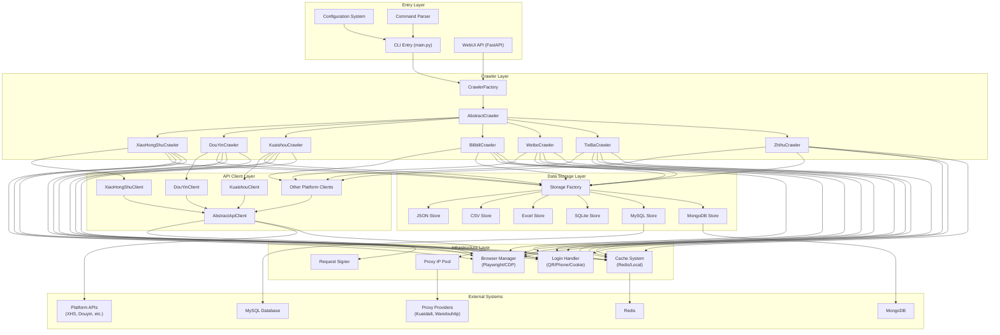
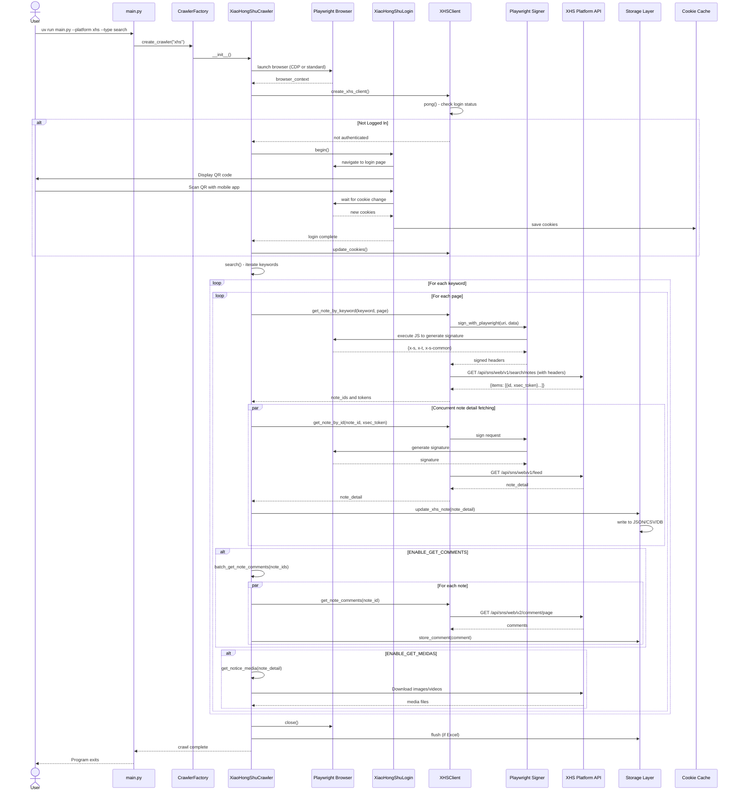
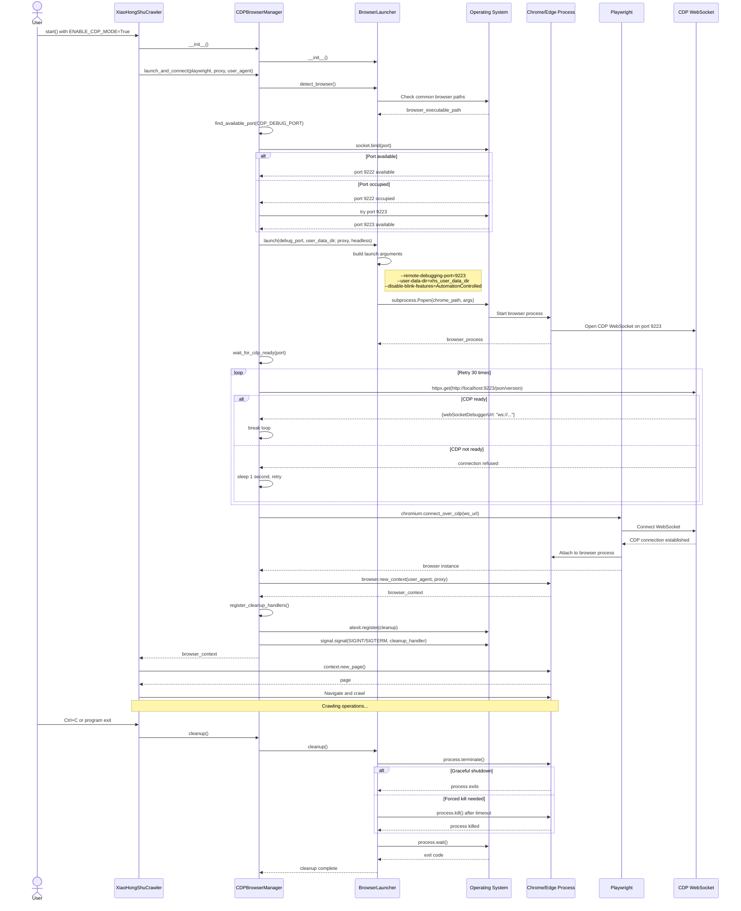
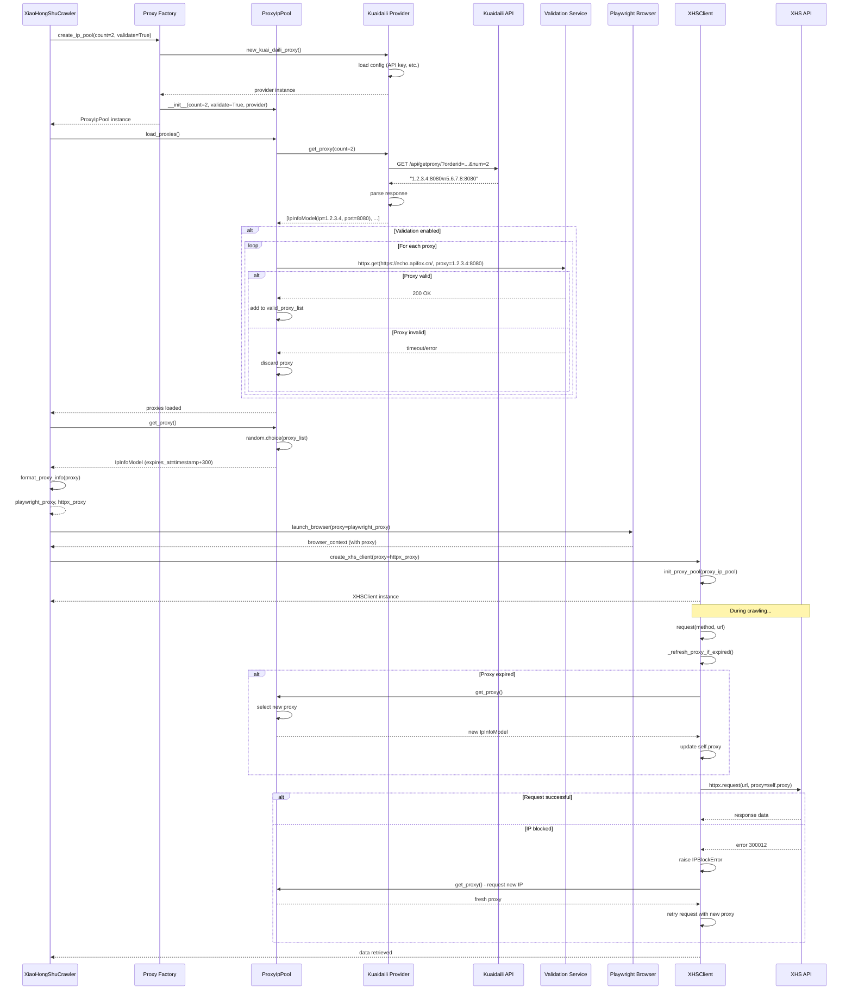
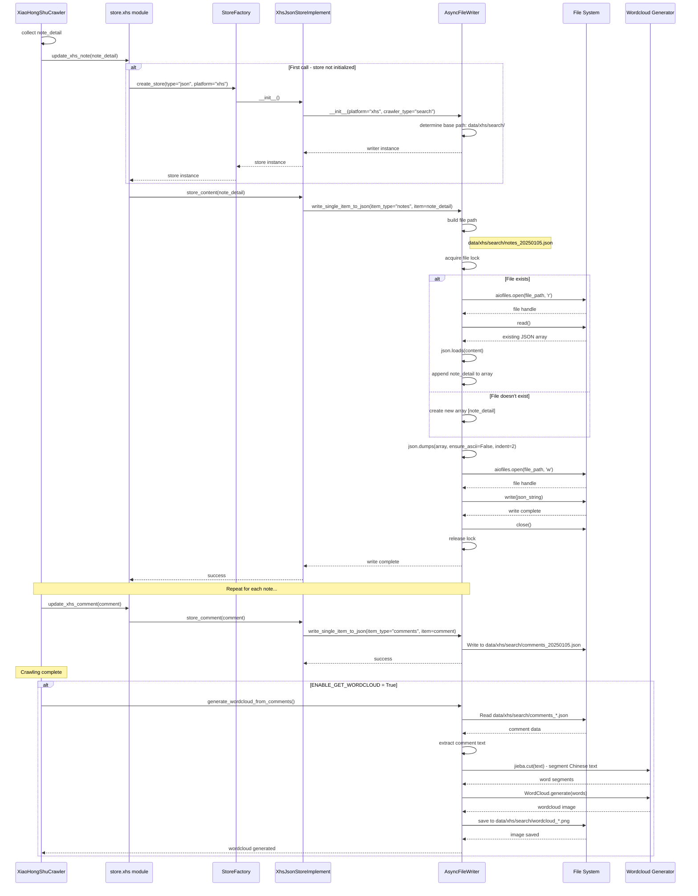

# MediaCrawler Architecture Analysis

## Project Overview

MediaCrawler is a comprehensive multi-platform social media data collection tool designed for educational and research purposes. The project enables automated crawling of public information from major Chinese social media platforms including Xiaohongshu (Little Red Book), Douyin (TikTok China), Kuaishou, Bilibili, Weibo, Baidu Tieba, and Zhihu. Built with Python's async/await paradigm, the system leverages browser automation via Playwright to maintain authenticated sessions and extract data without requiring complex JavaScript reverse engineering.

The core capability of MediaCrawler lies in its unified crawler framework that abstracts platform-specific implementations behind common interfaces. Users can search for content by keywords, retrieve specific posts by ID, or collect all content from particular creators. The system supports multiple authentication methods (QR code, phone, cookies), various data storage backends (JSON, CSV, Excel, SQLite, MySQL, MongoDB), and includes anti-detection features like CDP (Chrome DevTools Protocol) mode and proxy IP rotation.

**Main Technologies:**
- **Languages:** Python 3.11+, JavaScript (for signature generation), Node.js (for certain platforms)
- **Browser Automation:** Playwright (standard mode), CDP protocol (stealth mode)
- **Web Framework:** FastAPI (for WebUI API), Uvicorn (ASGI server)
- **Async Runtime:** asyncio, httpx (async HTTP client)
- **Data Processing:** pandas, openpyxl (Excel), jieba, wordcloud (text analysis)
- **Databases:** SQLite, MySQL (via asyncmy), MongoDB (via motor), SQLAlchemy ORM
- **Caching:** Redis (optional), local file cache
- **Package Management:** uv (recommended), pip

## Architecture Overview

MediaCrawler follows a modular monolithic architecture organized into distinct layers with clear separation of concerns. At the highest level, the application is structured around a factory pattern that instantiates platform-specific crawlers based on user configuration. Each platform implementation (XHS, Douyin, Kuaishou, etc.) inherits from abstract base classes that define the crawler contract, ensuring consistent behavior across different social media platforms.

The architecture consists of five primary layers: **Entry Layer** (main.py, command-line argument parsing, configuration management), **Crawler Layer** (platform-specific crawler implementations), **API Client Layer** (HTTP clients for platform APIs with request signing), **Data Storage Layer** (multiple backend adapters), and **Infrastructure Layer** (browser management, proxy pools, login handlers, caching).

Data flows through the system in a producer-consumer pattern. When initiated via CLI or WebUI, the crawler launches a browser context, authenticates the user, and begins fetching content based on the specified mode (search/detail/creator). Each piece of content is processed through an extraction pipeline, stored via the configured storage backend, and optionally has associated comments and media downloaded. The system supports concurrent crawling with configurable semaphores to control request rates and avoid platform rate limits.

External integrations include proxy IP providers (Kuaidaili, Wandouhttp) for IP rotation, Redis for distributed caching, and database systems for persistent storage. The WebUI component operates as a separate FastAPI application that spawns crawler processes as subprocesses and communicates results via WebSocket for real-time logging.

## Key Features

MediaCrawler provides a comprehensive set of features organized hierarchically across three main functional areas: **Content Crawling**, **Authentication & Anti-Detection**, and **Data Management**.

### 1. Content Crawling

The content crawling feature set enables users to collect various types of data from social media platforms through three primary modes of operation.

**Description:** Content crawling is the core functionality that extracts posts, videos, comments, and creator information from seven major Chinese social media platforms. The system supports concurrent crawling with configurable rate limiting and automatic retry mechanisms.

**Entry Points:** 
- CLI: `uv run main.py --platform <platform> --type <mode>`
- WebUI: POST `/api/crawler/start` with JSON payload
- Direct Python: `from main import main; asyncio.run(main())`

**Components & Data:** CrawlerFactory, platform-specific crawlers (media_platform/*/core.py), API clients (media_platform/*/client.py), storage implementations (store/*/)

#### 1.1 Search Mode

**Description:** Search mode crawls content by keywords across platforms. It retrieves posts/videos matching search terms, extracts metadata, and optionally downloads comments and media files. Supports pagination and configurable result limits.

**Entry Points:** 
- CLI: `--type search` with keywords in config.KEYWORDS
- Config: CRAWLER_TYPE = "search", KEYWORDS = "keyword1,keyword2"

**Components & Data:** XiaoHongShuCrawler.search(), XHSClient.get_note_by_keyword(), search result parsers, note detail fetchers

#### 1.2 Detail Mode

**Description:** Detail mode retrieves specific posts by their URLs or IDs. Users provide a list of post URLs, and the system fetches complete post details including content, statistics, and comments.

**Entry Points:**
- CLI: `--type detail` with URLs in platform config
- Config: CRAWLER_TYPE = "detail", XHS_SPECIFIED_NOTE_URL_LIST = ["url1", "url2"]

**Components & Data:** XiaoHongShuCrawler.get_specified_notes(), URL parsers (help.py), note detail API clients

#### 1.3 Creator Mode

**Description:** Creator mode extracts all content from specific creator profiles. Given creator URLs, the system retrieves creator information and all their published posts with associated comments.

**Entry Points:**
- CLI: `--type creator` with creator URLs in platform config
- Config: CRAWLER_TYPE = "creator", XHS_CREATOR_ID_LIST = ["creator_url"]

**Components & Data:** XiaoHongShuCrawler.get_creators_and_notes(), XHSClient.get_all_notes_by_creator(), creator info extractors

#### 1.4 Comment Extraction

**Description:** Comment extraction is a sub-feature that retrieves first-level and optionally second-level (reply) comments for each post. Supports configurable comment count limits per post.

**Entry Points:** Automatically triggered after content fetching if ENABLE_GET_COMMENTS = True

**Components & Data:** XiaoHongShuCrawler.batch_get_note_comments(), XHSClient.get_note_comments(), comment storage implementations

#### 1.5 Media Download

**Description:** Media download fetches images and videos associated with posts when enabled. Downloads are performed asynchronously and saved to local storage.

**Entry Points:** Automatically triggered if ENABLE_GET_MEIDAS = True

**Components & Data:** XiaoHongShuCrawler.get_notice_media(), media downloader utilities (store/*/xhs_store_media.py)

### 2. Authentication & Anti-Detection

This feature category encompasses mechanisms for logging into platforms and avoiding bot detection systems.

**Description:** Authentication and anti-detection features enable reliable access to platform data while minimizing the risk of account bans or IP blocks. Supports multiple login methods and advanced browser fingerprinting evasion.

**Entry Points:** Configured via LOGIN_TYPE, ENABLE_CDP_MODE, ENABLE_IP_PROXY in base_config.py

**Components & Data:** Login handlers (media_platform/*/login.py), CDPBrowserManager, ProxyIpPool, browser launchers

#### 2.1 QR Code Login

**Description:** QR code login displays a platform-specific QR code in the browser for users to scan with their mobile app. Once scanned and authorized, session cookies are captured and saved.

**Entry Points:** 
- CLI: `--lt qrcode`
- Config: LOGIN_TYPE = "qrcode"

**Components & Data:** XiaoHongShuLogin.login_by_qrcode(), browser context, cookie cache (cache/)

#### 2.2 Cookie Login

**Description:** Cookie login allows users to provide pre-captured authentication cookies directly, bypassing interactive login. Useful for automated deployments.

**Entry Points:**
- CLI: `--lt cookie`
- Config: LOGIN_TYPE = "cookie", COOKIES = "cookie_string"

**Components & Data:** XiaoHongShuLogin.login_by_cookies(), cookie parsers, cache managers

#### 2.3 Phone Login

**Description:** Phone login authenticates using phone number and SMS verification code (less commonly used, platform support varies).

**Entry Points:**
- CLI: `--lt phone`
- Config: LOGIN_TYPE = "phone"

**Components & Data:** XiaoHongShuLogin.login_by_mobile(), SMS receivers (recv_sms.py)

#### 2.4 CDP (Chrome DevTools Protocol) Mode

**Description:** CDP mode connects to a user's existing Chrome/Edge browser instance instead of launching a new automated browser. This provides better anti-detection capabilities by using a real user profile with extensions and history.

**Entry Points:** Config: ENABLE_CDP_MODE = True, CDP_DEBUG_PORT = 9222

**Components & Data:** CDPBrowserManager (tools/cdp_browser.py), BrowserLauncher (tools/browser_launcher.py)

#### 2.5 Proxy IP Rotation

**Description:** Proxy IP rotation distributes requests across multiple proxy IPs to avoid rate limiting and IP bans. Supports third-party proxy providers with automatic validation and refresh.

**Entry Points:** Config: ENABLE_IP_PROXY = True, IP_PROXY_POOL_COUNT = 2

**Components & Data:** ProxyIpPool (proxy/proxy_ip_pool.py), proxy providers (proxy/providers/), ProxyRefreshMixin

### 3. Data Management

Data management features control how collected data is stored, exported, and analyzed.

**Description:** Data management provides flexible storage backends and post-processing capabilities including deduplication, export to multiple formats, and text analysis.

**Entry Points:** Config: SAVE_DATA_OPTION = "json|csv|excel|sqlite|db|mongodb"

**Components & Data:** Storage factory pattern, platform-specific store implementations (store/*/)

#### 3.1 JSON Storage

**Description:** JSON storage writes each item as a separate JSON file or appends to array files. Lightweight and human-readable.

**Entry Points:** SAVE_DATA_OPTION = "json"

**Components & Data:** XhsJsonStoreImplement, AsyncFileWriter (tools/async_file_writer.py)

#### 3.2 CSV Storage

**Description:** CSV storage exports data to comma-separated value files compatible with Excel and data analysis tools.

**Entry Points:** SAVE_DATA_OPTION = "csv"

**Components & Data:** XhsCsvStoreImplement, CSV writers in AsyncFileWriter

#### 3.3 Excel Storage

**Description:** Excel storage creates XLSX spreadsheets with separate sheets for different data types (posts, comments, creators).

**Entry Points:** SAVE_DATA_OPTION = "excel"

**Components & Data:** XhsExcelStoreImplement, ExcelStoreBase (store/excel_store_base.py), openpyxl

#### 3.4 Database Storage

**Description:** Database storage persists data to relational (SQLite/MySQL) or NoSQL (MongoDB) databases with deduplication and schema management.

**Entry Points:** SAVE_DATA_OPTION = "sqlite" | "db" | "mongodb"

**Components & Data:** SQLAlchemy models (database/models.py), database sessions (database/db_session.py), MongoDB base (database/mongodb_store_base.py)

#### 3.5 Wordcloud Generation

**Description:** Wordcloud generation analyzes comment text and produces visual word cloud images showing frequently mentioned terms.

**Entry Points:** Config: ENABLE_GET_WORDCLOUD = True (only works with JSON storage)

**Components & Data:** AsyncFileWriter.generate_wordcloud_from_comments(), jieba segmentation, wordcloud library

### 4. WebUI Interface

**Description:** WebUI provides a web-based graphical interface for configuring and running crawlers without using the command line. Built with FastAPI backend and a static frontend.

**Entry Points:** 
- Start: `uv run uvicorn api.main:app --port 8080`
- Access: http://localhost:8080

**Components & Data:** FastAPI app (api/main.py), routers (api/routers/), WebSocket handlers, crawler manager service (api/services/), frontend (api/webui/)

## Feature Deep Dives

### Keyword Search Crawling (XiaoHongShu)

#### Overview

Keyword search crawling allows users to discover and collect posts from Xiaohongshu (Little Red Book) based on search terms. This is one of the most commonly used features for market research, trend analysis, and content monitoring.

#### End-to-End Technical Flow

1. **User initiates search**: User runs CLI command `uv run main.py --platform xhs --type search` or clicks "Start" in WebUI with search mode selected. Keywords are configured in config.KEYWORDS (e.g., "编程副业,编程兼职").

2. **Crawler initialization**: main.py parses arguments, CrawlerFactory creates XiaoHongShuCrawler instance, which launches a browser context (standard Playwright or CDP mode based on config).

3. **Authentication**: XiaoHongShuCrawler.start() checks if user is logged in by calling xhs_client.pong(). If not authenticated, XiaoHongShuLogin displays QR code for user to scan. After successful login, cookies are saved to cache.

4. **Search execution**: XiaoHongShuCrawler.search() iterates through each keyword, calling XHSClient.get_note_by_keyword() with pagination. Each API request requires signature generation via playwright_sign.sign_with_playwright() which injects JavaScript into the browser page to compute X-S, X-T headers.

5. **Result processing**: Search API returns note IDs and xsec_tokens. For each note, XiaoHongShuCrawler.get_note_detail_async_task() fetches full details concurrently (controlled by semaphore). Note details are extracted and passed to storage layer.

6. **Data storage**: Storage factory routes data to configured backend (e.g., XhsJsonStoreImplement writes to data/xhs/search/notes_*.json).

7. **Comment crawling**: If ENABLE_GET_COMMENTS is true, XiaoHongShuCrawler.batch_get_note_comments() fetches comments for all collected notes. Comments are stored separately from note data.

8. **Media download**: If ENABLE_GET_MEIDAS is true, XiaoHongShuCrawler.get_notice_media() downloads images/videos referenced in notes.

9. **Pagination**: Process repeats for next page until CRAWLER_MAX_NOTES_COUNT is reached or no more results available.

10. **Cleanup**: Browser context closes, Excel files flush if applicable, wordcloud generates if enabled.

#### Mermaid Sequence Diagram

#### Implementation Index

- **Entry point:** main.py (line 100-116) - main() function handles crawler initialization
- **Crawler core:** media_platform/xhs/core.py
  - XiaoHongShuCrawler.start() (line 65-124) - main entry point
  - XiaoHongShuCrawler.search() (line 126-183) - search implementation
  - XiaoHongShuCrawler.get_note_detail_async_task() (line 271-313) - fetch note details
  - XiaoHongShuCrawler.batch_get_note_comments() - fetch comments
- **API client:** media_platform/xhs/client.py
  - XiaoHongShuClient.get_note_by_keyword() - search API call
  - XiaoHongShuClient.get_note_by_id() - note detail API call
  - XiaoHongShuClient.get_note_comments() - comment API call
  - XiaoHongShuClient._pre_headers() (line 71-110) - request signing
- **Signature generation:** media_platform/xhs/playwright_sign.py
  - sign_with_playwright() - JavaScript injection for signature
- **Login:** media_platform/xhs/login.py
  - XiaoHongShuLogin.login_by_qrcode() - QR code login flow
- **Storage:** store/xhs/_store_impl.py
  - XhsJsonStoreImplement, XhsCsvStoreImplement, XhsDbStoreImplement
- **Data models:** database/models.py - XhsNote, XhsNoteComment tables
- **Configuration:** config/base_config.py, config/xhs_config.py

#### Limitations / Unknowns

- The exact signature algorithm used by Xiaohongshu is proprietary and executed via JavaScript injection, making it platform-dependent and subject to change
- Rate limiting thresholds are not documented and may vary based on account status
- The system does not handle CAPTCHA challenges automatically - manual intervention required
- Video download may fail for long videos due to timeout constraints
- Second-level comment support requires schema updates for existing database users

### CDP Browser Launch

#### Overview

CDP (Chrome DevTools Protocol) mode is an advanced anti-detection feature that connects to a user's existing Chrome or Edge browser instead of launching a fresh automated browser instance. This provides superior stealth capabilities as the browser retains the user's real profile, extensions, cookies, and browsing history.

#### End-to-End Technical Flow

1. **Configuration check**: When XiaoHongShuCrawler.start() runs, it checks if config.ENABLE_CDP_MODE is True.

2. **Browser detection**: CDPBrowserManager initializes and BrowserLauncher detects installed Chrome/Edge browsers by checking common installation paths on Windows/macOS/Linux.

3. **Port selection**: System attempts to bind to configured CDP_DEBUG_PORT (default 9222). If occupied, automatically tries next available ports.

4. **Browser process launch**: BrowserLauncher starts Chrome/Edge with flags: `--remote-debugging-port=<port>`, `--user-data-dir=<profile>`, `--disable-blink-features=AutomationControlled`, and proxy settings if enabled.

5. **Connection establishment**: Playwright connects to the running browser via CDP WebSocket endpoint (ws://localhost:<port>/devtools/browser/<id>).

6. **Context creation**: A new browser context is created within the connected browser, inheriting user profile but with isolated storage.

7. **Cleanup registration**: CDPBrowserManager registers atexit handlers and signal handlers (SIGINT, SIGTERM) to ensure browser process cleanup on program exit.

8. **Crawling proceeds**: Crawler uses the CDP-connected browser context normally for navigation and data extraction.

9. **Termination**: On program exit, if AUTO_CLOSE_BROWSER is True, the browser process is terminated via launcher.cleanup().

#### Mermaid Sequence Diagram

#### Implementation Index

- **CDP manager:** tools/cdp_browser.py
  - CDPBrowserManager class (line 35-195) - main CDP orchestration
  - CDPBrowserManager.launch_and_connect() - launches and connects browser
  - CDPBrowserManager._register_cleanup_handlers() (line 47-95) - cleanup registration
  - CDPBrowserManager.cleanup() - cleanup method
- **Browser launcher:** tools/browser_launcher.py
  - BrowserLauncher.detect_browser() - auto-detects browser installation
  - BrowserLauncher.launch() - starts browser process with CDP flags
  - BrowserLauncher.cleanup() - terminates browser process
- **Crawler integration:** media_platform/xhs/core.py
  - XiaoHongShuCrawler.start() (line 74-81) - CDP vs standard mode branching
  - XiaoHongShuCrawler.launch_browser_with_cdp() - CDP browser setup
- **Base class:** base/base_crawler.py
  - AbstractCrawler.launch_browser_with_cdp() (line 54-64) - interface definition
- **Configuration:** config/base_config.py (line 46-71) - CDP settings

#### Limitations / Unknowns

- CDP mode requires a compatible Chrome/Edge installation; Chromium derivatives may not work
- User data directory conflicts can occur if the browser is already running with the same profile
- Some browser extensions may interfere with CDP connections
- Headless CDP mode (CDP_HEADLESS=True) may still be detectable by advanced anti-bot systems
- The cleanup mechanism may fail to terminate browser processes if the Python process is killed forcefully (e.g., kill -9)
- WebSocket endpoint discovery has a 30-second timeout which may be insufficient on slow systems

### Proxy IP Rotation

#### Overview

Proxy IP rotation distributes crawler requests across multiple proxy servers to avoid rate limiting, IP bans, and geographic restrictions. The system maintains a pool of validated proxies and automatically refreshes them based on expiration times.

#### End-to-End Technical Flow

1. **Pool initialization**: If config.ENABLE_IP_PROXY is True, XiaoHongShuCrawler.start() calls create_ip_pool() to initialize a ProxyIpPool with configured count (IP_PROXY_POOL_COUNT).

2. **Provider selection**: Based on IP_PROXY_PROVIDER_NAME, the factory instantiates appropriate proxy provider (Kuaidaili or Wandouhttp).

3. **Proxy fetching**: ProxyIpPool.load_proxies() calls provider.get_proxy(count) to fetch IP addresses from the external provider's API.

4. **Validation**: If enable_validate_ip is True, each proxy is tested by making a request to a validation URL (https://echo.apifox.cn/). Invalid proxies are discarded.

5. **Proxy assignment**: ProxyIpPool.get_proxy() randomly selects a proxy from the validated pool and returns an IpInfoModel containing IP, port, credentials, and expiration time.

6. **Format conversion**: utils.format_proxy_info() converts IpInfoModel to both Playwright format (dict) and httpx format (URL string).

7. **Browser proxy setup**: Playwright browser context is launched with proxy configuration for all browser requests.

8. **HTTP client proxy setup**: XiaoHongShuClient receives httpx_proxy_format and uses it for all API requests.

9. **Automatic refresh**: Before each request, ProxyRefreshMixin._refresh_proxy_if_expired() checks if current proxy has expired. If expired, it fetches a new proxy and updates self.proxy.

10. **Error handling**: If a proxy returns IP blocking errors (IPBlockError with code 300012), the client can request a new proxy from the pool.

#### Mermaid Sequence Diagram

#### Implementation Index

- **Proxy pool:** proxy/proxy_ip_pool.py
  - ProxyIpPool class (line 41-145) - manages proxy lifecycle
  - ProxyIpPool.load_proxies() (line 60-66) - fetches proxies from provider
  - ProxyIpPool._is_valid_proxy() (line 68-94) - validates proxy
  - ProxyIpPool.get_proxy() (line 96-123) - returns random proxy from pool
- **Proxy providers:** proxy/providers/
  - kuaidaili_proxy.py - Kuaidaili implementation
  - wandouhttp_proxy.py - Wandouhttp implementation
- **Proxy mixin:** proxy/proxy_mixin.py
  - ProxyRefreshMixin class - adds auto-refresh capability to clients
  - _refresh_proxy_if_expired() - checks and refreshes expired proxies
- **Factory function:** proxy/proxy_ip_pool.py
  - create_ip_pool() (line 148-169) - creates pool with appropriate provider
- **Client integration:** media_platform/xhs/client.py
  - XiaoHongShuClient inherits ProxyRefreshMixin
  - XiaoHongShuClient.request() (line 112-149) - calls _refresh_proxy_if_expired
- **Crawler integration:** media_platform/xhs/core.py
  - XiaoHongShuCrawler.start() (line 67-70) - initializes proxy pool
  - XiaoHongShuCrawler.create_xhs_client() - passes proxy to client
- **Data models:** proxy/types.py - IpInfoModel, ProviderNameEnum
- **Configuration:** config/base_config.py (line 28-35) - proxy settings

#### Limitations / Unknowns

- Proxy quality depends entirely on the third-party provider; low-quality proxies will be discarded after validation
- Validation only tests connectivity, not whether the proxy works with specific platforms
- The system does not implement proxy quality scoring or blacklisting of consistently failing proxies
- Proxy rotation for browser requests requires relaunching the browser context (not implemented mid-session)
- Geographic proxy selection is not supported - proxies are selected randomly
- No mechanism exists to prefer certain proxies based on success rate
- Provider API rate limits may prevent frequent proxy refreshes

### Data Storage to JSON

#### Overview

JSON storage is the default and most commonly used data persistence method in MediaCrawler. It writes collected posts, comments, and creator information to JSON files organized by platform and crawler type. JSON format is human-readable, easily parsable, and suitable for later analysis with data science tools.

#### End-to-End Technical Flow

1. **Configuration**: User sets SAVE_DATA_OPTION = "json" in config/base_config.py.

2. **Factory initialization**: When XiaoHongShuCrawler stores data, it imports store.xhs module which triggers StoreFactory initialization.

3. **Store instantiation**: StoreFactory.create_store("json", "xhs") creates XhsJsonStoreImplement instance with AsyncFileWriter.

4. **File path determination**: AsyncFileWriter determines output path: data/{platform}/{crawler_type}/{item_type}_{timestamp}.json (e.g., data/xhs/search/notes_20250105.json).

5. **Data writing**: When crawler calls xhs_store.update_xhs_note(note_detail), it routes to XhsJsonStoreImplement.store_content().

6. **Async append**: AsyncFileWriter.write_single_item_to_json() locks the file, reads existing content, appends new item to array, writes back atomically.

7. **Comment storage**: Comments are stored separately via store_comment() to data/xhs/search/comments_*.json.

8. **Creator storage**: Creator profiles stored via store_creator() to data/xhs/creator/creators_*.json.

9. **File organization**: Each crawler run may create new files or append to existing ones based on date and item type.

10. **Optional wordcloud**: If ENABLE_GET_WORDCLOUD is True, after crawling completes, AsyncFileWriter.generate_wordcloud_from_comments() reads comment JSON files, segments text with jieba, and generates wordcloud image.

#### Mermaid Sequence Diagram

#### Implementation Index

- **Store implementation:** store/xhs/_store_impl.py
  - XhsJsonStoreImplement class (line 71-100) - JSON storage adapter
  - store_content() (line 76-82) - stores post data
  - store_comment() (line 84-90) - stores comment data
- **File writer:** tools/async_file_writer.py
  - AsyncFileWriter class - handles async file I/O
  - write_single_item_to_json() - appends item to JSON array file
  - generate_wordcloud_from_comments() - creates wordcloud from comment files
- **Store module:** store/xhs/__init__.py
  - update_xhs_note() - routes note data to store
  - update_xhs_comment() - routes comment data to store
  - save_creator() - routes creator data to store
- **Factory:** store/xhs/__init__.py
  - StoreFactory.create_store() - instantiates appropriate store type
- **Crawler integration:** media_platform/xhs/core.py
  - Calls xhs_store.update_xhs_note() after fetching note details
  - Calls xhs_store.update_xhs_comment() for each comment
- **Wordcloud generation:** main.py
  - _generate_wordcloud_if_needed() (line 86-97) - triggers wordcloud generation
- **Configuration:** config/base_config.py (line 73-74) - SAVE_DATA_OPTION, ENABLE_GET_WORDCLOUD

#### Limitations / Unknowns

- JSON file locking is process-local; concurrent processes writing to the same file may cause corruption
- Large JSON files (>100MB) may cause memory issues when reading/writing entire file
- No automatic deduplication - duplicate notes may be written if crawler reruns
- File organization by date means long-running crawlers may span multiple files
- The wordcloud feature only works with JSON storage, not other formats
- Wordcloud generation requires Chinese text segmentation (jieba), may not work well for other languages
- No built-in JSON schema validation - malformed data may be written

## Unknowns and Assumptions

### Platform-Specific Signature Algorithms

The request signing mechanisms for each platform (X-S, X-T headers for Xiaohongshu; similar signatures for Douyin and Kuaishou) are executed via JavaScript injection into the browser page. The actual algorithm implementations are not visible in the Python codebase, residing instead in the platforms' frontend JavaScript bundles. This creates a dependency on the platforms' current JavaScript code and means signatures may break if platforms update their anti-scraping measures. The assumption is that injecting JavaScript into a real browser context will always have access to the necessary signing functions, but there's no guarantee this will remain true.

**Evidence:** media_platform/xhs/playwright_sign.py line 25-65 shows JavaScript code being injected and executed, but the actual signing logic is invoked via `window._webmsxyw()` which is defined by the platform. Similarly, Douyin uses `window.byted_acrawler` (media_platform/douyin/).

**Next steps:** Examine the platforms' minified JavaScript bundles (usually loaded from CDN) to understand the signature algorithms. Consider implementing fallback mechanisms if JavaScript injection fails.

### Rate Limiting and Detection Thresholds

The codebase includes configurable sleep intervals (CRAWLER_MAX_SLEEP_SEC) and concurrency limits (MAX_CONCURRENCY_NUM), but the actual rate limits enforced by each platform are unknown and not documented. The code handles generic IP blocking errors (error code 300012 for Xiaohongshu) and CAPTCHA challenges (HTTP 471/461), but the specific conditions that trigger these responses are unclear. The assumption is that the current default values (1 concurrent request, variable sleep times) are conservative enough to avoid detection, but aggressive users may trigger bans.

**Evidence:** config/base_config.py defines limits but provides no rationale. media_platform/xhs/client.py line 132-138 detects CAPTCHA but doesn't solve it automatically.

**Next steps:** Conduct systematic experiments to determine safe rate limits per platform. Implement adaptive rate limiting based on response patterns.

### CDP Mode Compatibility

CDP mode is assumed to work with any Chromium-based browser (Chrome, Edge, Brave, etc.), but the BrowserLauncher.detect_browser() method only checks for Chrome and Edge in specific paths. Other Chromium browsers may work but are untested. The assumption is that all Chromium browsers implement the CDP protocol identically, which may not be true for heavily modified forks.

**Evidence:** tools/browser_launcher.py defines paths only for Chrome and Edge on major OS platforms. The code logs a warning if detection fails but doesn't prevent users from manually specifying a path via CUSTOM_BROWSER_PATH.

**Next steps:** Test with additional Chromium browsers (Brave, Vivaldi, Opera). Document which browsers are verified to work.

### Database Schema Evolution

The database storage implementations (SQLite, MySQL, MongoDB) use predefined schemas (database/models.py), but there's no clear migration strategy for schema changes. The code mentions that users of old database versions need to manually update schemas to support features like second-level comments (ENABLE_GET_SUB_COMMENTS). The assumption is that users will manually run SQL ALTER statements, but this is error-prone.

**Evidence:** config/base_config.py line 98-99 comments mention manual schema updates. No Alembic migrations are present despite alembic being in requirements.txt.

**Next steps:** Implement proper database migrations using Alembic. Provide migration scripts for common schema changes.

### Proxy Provider Reliability

The system integrates with third-party proxy providers (Kuaidaili, Wandouhttp) and assumes their APIs will remain stable. However, provider-specific implementations (proxy/providers/) include hardcoded API endpoints and authentication methods that may change without notice. The validation mechanism tests connectivity but doesn't verify that proxies work specifically with the target platforms (some platforms may block known proxy ranges).

**Evidence:** proxy/providers/kuaidaili_proxy.py and wandouhttp_proxy.py contain API URLs and parameters but no version negotiation. Validation in proxy/proxy_ip_pool.py line 68-94 only tests a generic endpoint.

**Next steps:** Implement provider API health checks. Add platform-specific proxy validation. Consider supporting additional providers.

### WebUI Frontend Implementation

The WebUI feature is documented in the README and the FastAPI backend exists (api/), but the frontend implementation details are unclear. The api/main.py mounts a webui/ directory for static files, but the source code for this frontend is not present in the repository (only the built artifacts would be at api/webui/). The assumption is that the frontend is built separately using a modern JavaScript framework (likely Vue or React based on the mention of Vite in package.json), but the source code location is unknown.

**Evidence:** api/main.py line 42, 173-182 references api/webui/ directory for serving static files. package.json includes vitepress but no clear frontend framework dependencies.

**Next steps:** Locate or document the WebUI frontend source code. Clarify the build process for the frontend.

### Platform-Specific Feature Parity

While the codebase supports seven platforms, not all features are implemented uniformly. The README's feature matrix shows full support for all platforms, but code inspection reveals that some implementations are more mature than others (Xiaohongshu has the most complete implementation). The assumption is that all platform crawlers follow the same basic flow, but edge cases and platform-specific features may not be handled consistently.

**Evidence:** media_platform/xhs/ has 10 Python files with extensive logic, while some other platform directories have fewer files. The base_crawler.py line 97-99 notes that only XHS supports creator storage via the abstract interface.

**Next steps:** Audit each platform implementation for feature completeness. Document platform-specific limitations. Standardize error handling and retry logic across all platforms.
